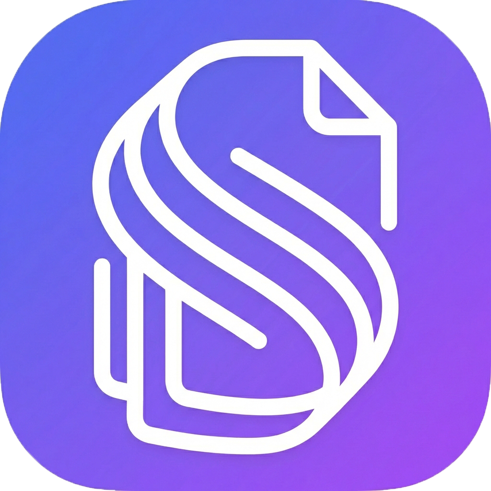

# Synchro Scan
## Aplikasi OCR Berbasis AI untuk Dokumen Indonesia



**Synchro Scan** adalah aplikasi web yang menggunakan teknologi AI (Google Gemini) untuk mengekstrak data dari berbagai dokumen Indonesia seperti KTP, STNK, BPKB, SIM, dan lainnya secara otomatis.

---

## ✨ Fitur Utama

- 📄 **Multi-Document Support** - KTP, STNK, BPKB, SIM, KK, Passport, Invoice
- 🤖 **AI-Powered OCR** - Menggunakan Google Gemini AI
- 📊 **Dashboard Analytics** - Statistik dan grafik real-time
- 🔒 **Secure Authentication** - JWT dengan HTTP-only cookies
- 📱 **Responsive Design** - Material-UI untuk tampilan modern
- 🔄 **Auto-cleanup** - Recent scans otomatis terhapus (max 10)

---

## 🚀 Quick Start

### Prerequisites

- Node.js 18+
- MySQL 8+
- npm 9+

### Installation

```bash
# Clone repository
git clone https://github.com/azrilachmad/ocr-app-frontend.git
cd ocr-app-frontend

# Setup Backend
cd Backend
npm install
cp .env.example .env  # Edit dengan konfigurasi Anda

# Setup Frontend
cd ../Frontend
npm install

# Jalankan Backend (Terminal 1)
cd Backend
npm run dev

# Jalankan Frontend (Terminal 2)
cd Frontend
npm start
```

Buka browser: http://localhost:3004

---


## 🛠️ Tech Stack

### Frontend
- React.js 18
- Vite 6
- Material-UI 5
- React Router 6
- Axios

### Backend
- Node.js
- Express.js
- Sequelize ORM
- MySQL
- JWT Authentication
- Multer (file upload)

### AI
- Google Gemini API

---

## 📁 Struktur Proyek

```
ocr-app-frontend/
├── Frontend/           # React application
│   ├── public/         # Static assets
│   └── src/
│       ├── components/ # Reusable components
│       ├── pages/      # Page components
│       └── services/   # API services
│
├── Backend/            # Express API server
│   └── src/
│       ├── controllers/
│       ├── middleware/
│       ├── models/
│       ├── routes/
│       └── services/
│
└── docs/               # Documentation
```

---

## 🔒 Security Features

- ✅ Helmet security headers
- ✅ Rate limiting
- ✅ Input validation (express-validator)
- ✅ XSS prevention
- ✅ CORS configuration
- ✅ Path traversal protection
- ✅ JWT HTTP-only cookies
- ✅ Password hashing (bcrypt)

---

## 📸 Screenshots

### Dashboard
Statistik overview dan grafik aktivitas harian.

### Upload Document
Upload dan proses dokumen dengan AI.

### Scan History
Riwayat scan dengan filter dan pencarian.

---

## 🔑 Environment Variables

### Backend (.env)

```env
PORT=3001
NODE_ENV=development
DB_HOST=localhost
DB_PORT=3306
DB_NAME=synchro_scan
DB_USER=root
DB_PASS=your_password
JWT_SECRET=your_jwt_secret
UPLOAD_PATH=./uploads
MAX_FILE_SIZE=10485760
GEMINI_API_KEY=your_api_key
```

---

## 📝 License

Copyright © Synchro 2017 - 2025. All rights reserved.

---

## 👥 Kontak

- Email: support@synchro.com
- Website: https://synchro.com
